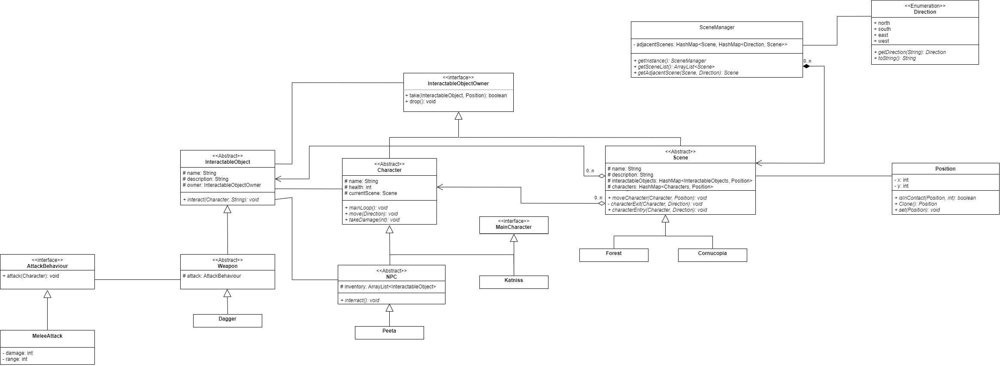

# Hunger Games Simulator


A multithreaded Java application that demonstrates the use of design patterns such as Observer, Singleton, Template, Strategy, State, and Command. 

## Introduction
The Hunger Games is an event where characters have to participate in a fight to the death which only 1 participant survives. The game we developed takes the characters of the Hunger Games and allows the player to participate in the Hunger Games as the main character, Katniss Everdeen, as she tries to survive the Hunger Games. The game allows you to encounter and interact with 4 other characters and collect items and weapons scattered around the different scenes of the game. It implements sensors with the help of an app on the This idea comes from the book/movie series, which is a rather well known one, and a significant number of people have heard of it before if not watched/read it. This text-based game gives the player an opportunity to experience the Hunger Games in an interesting way. 

## Objective
The objective of the game is to defeat all other characters found in the different areas in the game without dying. This is done with the help of different weapons found around the arena and certain consumables that allow the main character to regain health. 

## Class Diagram



## Using Design Patterns
### 1. Observer
The observer was used for 2 aspects of the game. The first aspect of the game was the narrator. The narrator is a class that observes what happens in the game (such as taking damage, healing, death) and prints them to the screen. In this case there 
``` java
public interface Observer {
    void update(Message m);
}

public interface Subject {
    void registerObserver(Observer o);
    void removeObsever(Observer o);
    void publishMessage(Message m);
}

// the message sent to observers
public class Message {
    public Object origin;
    public String topic;
    public String payload;
}

// the narrator observer class
public class Narrator extends ConcreteObserver {
    
    // calls registerObserver on all subjects passed in
    public Narrator(ArrayList<Character> subject) {
       super(subject); 
    }
    
    // receives updates from subjects
    public void update(Message m) {
       switch(m.topic)
       {
          case "health" -> {
             UI.getInstance().print("Narrator: " + ((Character) m.origin).getName() + "'s health is running low!");
       }
    }
}

// the subject which is the base class for all characters (player/npcs)
public abstract class Character implements InteractableObjectOwner, Subject {
    // called when character is damaged
    public void takeDamage(int damage) {
        health -= damage;
        if (health == 1) {
            publishMessage(new Message(this, "health", "low health"));
        }
        else if (health == 0) {
            publishMessage(new Message(this, "death", name + " has dying"));
            currentScene.killCharacter(this);
        }
    }
}
```
The observer pattern is also used for NPC’s to get to know when players interact with them and the observer patten is used to update their state
```java
// the main character class as subject
public class Katniss extends Character implements MainCharacter, Runnable {
    // called when player wants to move
    public void move(Direction direction) {
        super.move(direction);
        UI.getInstance().print("You have moved", direction);

        var npc = getCurrentScene().getNearbyNPC(this);
        if (npc != null) {
            UI.getInstance().print("You have encountered", npc.getName());
            publishMessage(new Message(this, "meet", ""));
        }
    }

// NPC Observer class 
public abstract class NPC extends Character implements Observer, Runnable {
    // receives updates from subjects
    public void update(Message message) {
        // if a main character does something to npc
        if (message.origin instanceof MainCharacter && ((Katniss) message.origin).getCurrentScene() == getCurrentScene()) {
            switch (message.topic) {
                case "meet" -> {
                    changeState();// changes NPC state
                }
            }
        }
    }
```

### 2. Singleton
The singleton pattern is used in 3 aspects of the game, the first is the UI class which is used for reading and writing to the console. There is only one console and reading/writing to that should be synchronized hence we use singleton here to enforce that.
```java
public class UI {
    private static UI instance;
    private UI() {
        scanner = new Scanner(System.in);
    }

    public static UI getInstance() {
        if (instance == null)
            instance = new UI();
        return instance;
    }

    public synchronized void print(Object... args) {
        // code removed for brevity 
        printInternal(output.toString(), true, false);
        // code removed for brevity
    }
}
```

It is also used for managing all the scenes and the routing between them in the Scene manager class. 
```java
public class SceneManager {
    private static SceneManager instance = null;
    private final HashMap<Scene, HashMap<Direction, Scene>> adjacentScenes;

    private SceneManager() {
        // code removed for brevity
    }
    public static SceneManager getInstance() {
        if (instance == null) {
            instance = new SceneManager();
        }
        return instance;
    }

    public Scene getAdjacentScene(Scene currentScene, Direction exitDirection) {
        return adjacentScenes.get(currentScene).get(exitDirection);
    }
}
```

It is also used for managing the connection to the sensor and handling the reading from the sensor. There is only 1 connection to the sensor hence it makes sense to use singleton here
```java
public class SensorManager implements Runnable {
    private String host = "192.168.1.14";
    private int port = 26950;
    private SensorBehaviour sensorBehaviour;
    private final JSONParser parser = new JSONParser();
    private boolean isRunning = false;
    private static SensorManager instance = null;

    private SensorManager() {
       // code removed for brevity
    }

    public static SensorManager getInstance()
    {
       if(instance == null) {
          instance = new SensorManager();
       }
       return instance;
    }
}
```

### 3. Template 
The template pattern was used in 2 places. The first place was for the use object commands that needed input from the sensor to work. The template pattern was used here since there is a fixed sequence for this command: set what sensor should be used, prompt user to do the action, wait for action, cause effects on the game. So, this sequence was used in the execute command and its inheritors just implement setSensorBehaviour and onSuccess
```java
// the template class
public abstract class SensorCommand implements InteractableObjectCommand {
    @Override
    public final void execute(Character sender) {
        var sensorManager = SensorManager.getInstance();

        // still let the app run if sensor not connected
        var sensorConnected = setSensorBehaviour(sensorManager);
        if (sensorConnected) {
            if (printPrompt()) {
                sensorManager.getSensorBehaviour().printPrompt();
            }

            while (sensorManager.isStillRunning()) {
                try {
                    Thread.sleep(100);
                } catch (InterruptedException e) {
                    UI.getInstance().print(e);
                }
            }
        }

        onSuccess(sender);
    }

    // A function called by execute() to set the sensor behaviour
    public abstract boolean setSensorBehaviour(SensorManager sensorManager);

    
     // A function called by execute() to that is called on successful completion of the sensor
    protected abstract void onSuccess(Character sender);

    // A hook function which can be overridden to not print the starting prompt
    public boolean printPrompt() {
        return true;
    }
}

// A class that uses the template
public class ClimbTree extends SensorCommand {
    @Override
    public boolean setSensorBehaviour(SensorManager sensorManager) {
        return sensorManager.setSensorBehaviour(new Climbing());
    }

    @Override
    protected void onSuccess(Character sender) {
        UI.getInstance().print("You have climbed the tree");
    }
}
```

The template pattern was also used in Consumables class. It was used here because using a consumable constituted of 3 steps, opening, consuming, and throwing. So that can be encapsulated in the consume function and its sub classes can override open, consume and throw
```java
// the template class
public abstract class Consumable extends InteractableObject implements Runnable {
    public final void consume(Character sender) {
        openWrapping();
        consumeObject();
        throwWrapping();
        state.getEffect().affect(sender);
    }
}

// A class that uses the template
public class Fish extends Consumable {
    public Fish() {
        super("Fish", "A fish. It looks delicious");
    }

    protected void throwWrapping() {
        UI.getInstance().print("You throw the fish bones on the ground");
    }

    protected void consumeObject(){
        UI.getInstance().print("You eat the fish");
    }

    protected void openWrapping() {
        UI.getInstance().print("You remove the fish outer scales");
    }
}
```


### 4. Strategy 
The strategy pattern was used for 3 aspects of the application. The first aspect was for sensor behaviors. Since there is 1 sensor manager and 4 different sensors, it makes sense to use strategy pattern to tell the sensor manager how to read the sensor
```java
public interface SensorBehaviour {
    void printPrompt();
    double[] parseJson(JSONObject jsonObject);
    boolean isBehaviourFound(double[] values);
}
public class Swinging implements SensorBehaviour {
    @Override
    public void printPrompt() {
        UI.getInstance().print("Swing to continue...");
    }

    @Override
    public double[] parseJson(JSONObject jsonObject) {
        JSONObject accObject = (JSONObject) jsonObject.get("accelerometer");
        JSONArray accValues = (JSONArray) accObject.get("value");
        double AccX = (double) accValues.get(0);
        double AccY = (double) accValues.get(1);
        double AccZ = (double) accValues.get(2);
        return new double[]{AccX, AccY, AccZ};
    }

    @Override
    public boolean isBehaviourFound(double[] values) {
        return (Math.abs(values[0]) > 17) && ((Math.abs(values[1]) > 17));
    }
}

public class SensorManager implements Runnable {
    private SensorBehaviour sensorBehaviour; 

    // code removed for brevity

    // function to set the strategy
    public boolean setSensorBehaviour(SensorBehaviour sensorBehaviour) {
       if (!isRunning) {
          warnServerNotRunning();
          return false;
       }
       this.sensorBehaviour = sensorBehaviour;
       return true;
    }

    public void run() {
       try (Socket socket = new Socket(this.host, this.port)) {

          isRunning = true;

          InputStream input = socket.getInputStream();
          InputStreamReader reader = new InputStreamReader(input);

          BufferedReader br = new BufferedReader(reader);
          String line = "";

          while ((line = br.readLine()) != null) {
             JSONObject jsonObject = (JSONObject) parser.parse(line);

             // use the strategy
             if (sensorBehaviour != null) {
                var values = sensorBehaviour.parseJson(jsonObject);
                if (sensorBehaviour.isBehaviourFound(values)) {
                   sensorBehaviour = null;
                }
             }
          }
       } 
    // code removed for brevity
    }

    public boolean isStillRunning() {
       return sensorBehaviour != null;
    }
}
```

It is also used for attacks, as attacks can be melee or ranged.
```java
public interface AttackBehaviour {
    void attack(Character sender);
}
// implementing the stratergy
public class MeleeAttack implements AttackBehaviour {
    private final int damage;
    public MeleeAttack(int damage) {
        this.damage = damage;
    }

    @Override
    public void attack(Character sender) {
        var scene = sender.getCurrentScene();
        var position = sender.getPosition();

        for (Map.Entry<Character, Position> entry : scene.getCharacters().entrySet()) {
            var character = entry.getKey();
            var characterPosition = entry.getValue();

            // can't attack yourself
            if (character == sender)
                continue;

            if (characterPosition.isInContact(position)) {
                character.takeDamage(damage);
                sender.publishMessage(new Message(sender, "damage", damage + " damage to " + character.getName()));

                return;
            }
        }
    }
}
// The class using the strategy 
public class Dagger extends Weapon {
    public Dagger() {
        super("Dagger",
                "A short blade that can be used to stab foes",
                new MeleeAttack(1));
    }
}
```

It is also used for consumable behavior, as the consumable may heal or damage the player depending on if its rotten or fresh. Hence it makes sense to use strategy pattern here as there are multiple behaviors that need to be changed at runtime
```java
public interface ConsumableBehavior {
    void affect(Characters.Character sender);
}
// implementing the strategy 
public class Heal implements ConsumableBehavior{
    private final int healAmount;

    public Heal(int healAmount) {
        this.healAmount = healAmount;
    }

    @Override
    public void affect(Character sender) {
        sender.heal(healAmount);
    }
}

// The class using the strategy
public class Fresh implements ConsumableState{
    @Override
    public void next(Consumable object) {
        object.setState(new Stale());
    }

    @Override
    public ConsumableBehavior getEffect() {
        return new Heal(2);
    }
    @Override
    public String toString() {
        return "Fresh";
    }
}

```

### 5. State
The state pattern was used for 2 aspects of the game. The first aspect was for NPCs. NPC’s can have different states (Dormant, Attacking, etc.) so using the state pattern to model it makes sense
```java
public interface CharacterState {
    void prev(NPC npc);
    void next(NPC npc);
}

public class Talk implements CharacterState {
    public Talk(NPC npc) {
        npc.talk();
    }
    @Override
    public void prev(NPC npc) {
        npc.setState(Attack.name);
    }

    @Override
    public void next(NPC npc) {
        npc.setState(Give.name);
    }

    @Override
    public String toString() {
        return name;
    }

    public static final String name = "Talking";
}

public abstract class NPC extends Character implements Observer, Runnable {

    private CharacterState state = new Dormant();

    public NPC(String name, int health, ArrayList<InteractableObject> inventory) {
        super(name, health);

        this.inventory = inventory;
        for (InteractableObject object : inventory) {
            object.setOwner(this);
        }
        new Thread(this).start();
    }

    public void run() {
        try {
            Thread.sleep(30 * 1000);
            changeState();
        } catch (Exception e) {
            UI.getInstance().printError(e);
        }
    }

    // an observer function, called by subjects
    public void update(Message message) {
        // if a main character does something to npc
        if (message.origin instanceof MainCharacter && ((Katniss) message.origin).getCurrentScene() == getCurrentScene()) {
            switch (message.topic) {
                case "meet" -> {
                    changeState();
                }
                case "attack" -> {
                    // if they attacked the npc, then the npc will attack back with a 30% chance
                    if (random.nextInt(10) < 3) {
                        setState(new Attack(this));
                    }
                }
            }
        }
    }

    public void changeState() {
        // 70% chance to go to next state, 30% chance to go to previous state
        if (random.nextInt(10) > 3) {
            nextState();
        } else {
            prevState();
        }
    }

    public void nextState() {
        state.next(this);
    }

    public void prevState() {
        state.prev(this);
    }


    public synchronized void setState(String state) {
        if (SceneManager.getInstance().getMainCharacter().getCurrentScene() == getCurrentScene() && health > 0) {
            this.state = createState(state);
        }
    }

    public String getState() {
        return state.toString();
    }
}
```

It was also used to model the state of consumables (Fresh, stale, rotten)
```java
public interface ConsumableState {
    void next(Consumable object);
    ConsumableBehavior getEffect();
}

public class Fresh implements ConsumableState{
    @Override
    public void next(Consumable object) {
        object.setState(new Stale());
    }

    @Override
    public ConsumableBehavior getEffect() {
        return new Heal(2);
    }
    @Override
    public String toString() {
        return "Fresh";
    }
}

public abstract class Consumable extends InteractableObject implements Runnable {
    private ConsumableState state = new Fresh();

    public Consumable(String name, String description)
    {
        // code removed for brevity
        new Thread(this).start();
    }

    @Override
    public void run() {
        while (true) {
            try {
                Thread.sleep(60 * 1000);
                if (random.nextInt(10) < 3) {
                    nextState();
                }
            } catch (InterruptedException e) {
                UI.getInstance().printError(e);
            }
        }
    }
    public final void consume(Character sender) {
        openWrapping();
        consumeObject();
        throwWrapping();
        state.getEffect().affect(sender);
    }


    public void nextState() {
        state.next(this);
    }

    public synchronized void setState(ConsumableState state) {
        this.state = state;
    }

    public ConsumableState getState() {
        return state;
    }
}
```


### 6. Command
The command pattern was used for 2 aspects of the game. The first aspect was for commands to the main character. This was done as there are multiple commands the main character can take (walk, use, look, etc.) so it is good to separate those into different classes, so it is extendible.
```java
// Command interface
public interface CharacterCommand {
    void execute(String[] args);
    String[] getAliases();
    String getDescription();
}
// A class that is a command
public class Move implements CharacterCommand {
    private final Katniss katniss;

    public Move(Katniss katniss) {
        this.katniss = katniss;
    }
    @Override
    public void execute(String[] args) {
        if (args.length != 2) {
            UI.getInstance().print("I can't move there");
            return;
        }
        // Check if input is a valid direction
        Direction direction = Direction.getDirection(args[1]);
        if (direction == null) {
            UI.getInstance().print("I can't move there");
            return;
        }
        // call the function in reciever
        katniss.move(direction);
    }

    @Override
    public String[] getAliases() {
        return new String[]{"move", "go", "walk"};
    }

    @Override
    public String getDescription() {
        return "Moves the character in the specified direction (args: either north, south, east, west)";
    }
}

// The control panel/receiver class.
public class Katniss extends Character implements MainCharacter, Runnable {
    private final ArrayList<CharacterCommand> commands;
    private final HashMap<String, Integer> commandMap; 
    // code removed for brevity

    public Katniss() {
        super("Katniss", 5);

        inventory = new ArrayList<>();

        commands = new ArrayList<>();
        commands.add(new Move(this));
        commands.add(new Take(this));
        commands.add(new Inventory(this));
        commands.add(new Look(this));
        commands.add(new Health(this));
        commands.add(new LookAround(this));
        commands.add(new Use(this));
        commands.add(new Interact(this));
        commands.add(new Map(this));
        commands.add(new Drop(this));
        commands.add(new Inspect(this));
        commands.add(new Quit(this));

        // create a string lookup so user input can be mapped to commands
        commandMap = new HashMap<>();
        for(CharacterCommand command : commands) {
            for (String alias : command.getAliases()) {
                commandMap.put(alias, commands.indexOf(command));
            }
        }
        // code removed for brevity
    }
    // called in the run function
    public void mainLoop() throws InterruptedException {

        while(currentScene == null) Thread.sleep(100);

        var ui = UI.getInstance();
        while (health > 0) {
            String[] inputs = ui.read().strip().toLowerCase().split(" ");
            String commmand = inputs[0];
            if (commandMap.containsKey(commmand)) {
                commands.get(commandMap.get(commmand)).execute(inputs);
            }
            // code removed for brevity
            else {
                ui.print("Invalid command");
            }
        }
    }

    public void move(Direction direction) {
        super.move(direction);
        UI.getInstance().print("You have moved", direction);
        // code removed for brevity
    }
}
```


It is also used for commands passed onto objects (just as consume, drop, etc.) It is useful here as there are many commands an object can have so separation of them into different classes is helpful.
```java
// command interface
public interface InteractableObjectCommand {
    void execute(Character sender);
    String getName();
}

// A class that is a command
public class Drop implements InteractableObjectCommand{
    private final InteractableObject object;

    public Drop(InteractableObject object) {
        this.object = object;
    }
    @Override
    public void execute(Character sender) {
        object.drop(sender);
    }

    @Override
    public String getName() {
        return "drop";
    }
}
// The control panel/receiver class.
public abstract class Weapon extends InteractableObject {

    private final ArrayList<InteractableObjectCommand> commands;
    private final HashMap<String, Integer> commandMap;
    protected AttackBehaviour attackBehaviour;

    public Weapon(String name, String description, AttackBehaviour attackBehaviour) 
    {
        super(name, description);
        this.attackBehaviour = attackBehaviour;

        commands = new ArrayList<>();
        commands.add(new InteractableObjects.InteractableObjectCommands.Take(this));
        commands.add(new InteractableObjects.InteractableObjectCommands.Inspect(this));
        commands.add(new InteractableObjects.InteractableObjectCommands.Destroy(this));
        commands.add(new InteractableObjects.InteractableObjectCommands.Drop(this));
        commands.add(new Attack(this));

        commandMap = new HashMap<>();
        for(InteractableObjectCommand command : commands) {
            commandMap.put(command.getName(), commands.indexOf(command));
        }
    }

    @Override
    public void interact(Character sender, String command) {
        if (commandMap.containsKey(command)) {
            commands.get(commandMap.get(command)).execute(sender);
        } else {
            Singletons.UI.getInstance().print("I can't do that with ", name);
        }
    }
}
```

## Multithreading
There are multiple threads running in the game. All started in the driver class (Game.java). The most important thread is the main character thread (in Katniss.java) which handles the main character functions and parsing input from user. The other important thread is the sensor thread (in Sensor.java). This thread handles communication and reading from the sensor. Deadlock is used to wait for the sensor thread to give a response while synchronized function with semaphores are used when using/setting the sensor behavior. The semaphores enforce that the same sensor that read the json, parses it.
```java
// function called from the main character thread
public abstract class SensorCommand implements InteractableObjectCommand {
    @Override
    public final void execute(Character sender) {
        var sensorManager = SensorManager.getInstance();

        var sensorConnected = setSensorBehaviour(sensorManager);
        if (sensorConnected) {
            if (printPrompt()) {
                sensorManager.getSensorBehaviour().printPrompt();
            }
            
            // the deadlock
            while (sensorManager.isStillRunning()) {
                try {
                    Thread.sleep(100);
                } catch (InterruptedException e) {
                    UI.getInstance().print(e);
                }
            }
        }

        onSuccess(sender);
    }

// the sensor thread
public synchronized boolean setSensorBehaviour(SensorBehaviour sensorBehaviour) {
    if (!isRunning) {
       warnServerNotRunning();
       return false;
    }
    try {
       semaphore.acquire();
       this.sensorBehaviour = sensorBehaviour;
       semaphore.release();
    } catch (InterruptedException e) {
       throw new RuntimeException(e);
    }

    return true;
}

public void run() {
    try (Socket socket = new Socket(this.host, this.port)) {

       isRunning = true;

       InputStream input = socket.getInputStream();
       InputStreamReader reader = new InputStreamReader(input);

       BufferedReader br = new BufferedReader(reader);
       String line = "";

       while ((line = br.readLine()) != null) {
          JSONObject jsonObject = (JSONObject) parser.parse(line);
          semaphore.acquire();
          if (sensorBehaviour != null) {
             var values = sensorBehaviour.parseJson(jsonObject);
             if (sensorBehaviour.isBehaviourFound(values)) {
                sensorBehaviour = null;
             }
          }
          semaphore.release();
       }
    } 
}
```

Also, each NPC and each Consumable are its own thread. Each of them use their thread to random change state after some time. Synchronization is done using synchronized functions which are used to change state
```java
public abstract class Consumable extends InteractableObject implements Runnable {
    private ConsumableState state = new Fresh();

    @Override
    public void run() {
        while (true) {
            try {
                Thread.sleep(60 * 1000);
                if (random.nextInt(10) < 3) {
                    nextState();
                }
            } catch (InterruptedException e) {
                UI.getInstance().printError(e);
            }
        }
    }

    public void nextState() {
        state.next(this);
    }

    public synchronized void setState(ConsumableState state) {
        this.state = state;
    }
}


public abstract class NPC extends Character implements Observer, Runnable {

    private CharacterState state = new Dormant();

    public void run() {
        try {
            Thread.sleep(30 * 1000);
            changeState();
        } catch (Exception e) {
            UI.getInstance().printError(e);
        }
    }

    public void update(Message message) {
        // if a main character does something to npc
        if (message.origin instanceof MainCharacter && ((Katniss) message.origin).getCurrentScene() == getCurrentScene()) {
            switch (message.topic) {
                case "meet" -> {
                    changeState();
                }
                case "attack" -> {
                    // if they attacked the npc, then the npc will attack back with a 30% chance
                    if (random.nextInt(10) < 3) {
                        setState(new Attack(this));
                    }
                }
            }
        }
    }

    public void changeState() {
        // 70% chance to go to next state, 30% chance to go to previous state
        if (random.nextInt(10) > 3) {
            nextState();
        } else {
            prevState();
        }
    }


    public void nextState() {
        state.next(this);
    }

    public void prevState() {
        state.prev(this);
    }

    public synchronized void setState(CharacterState state) {
        if (health > 0) {
            this.state = state;
        }
    }
}
```
